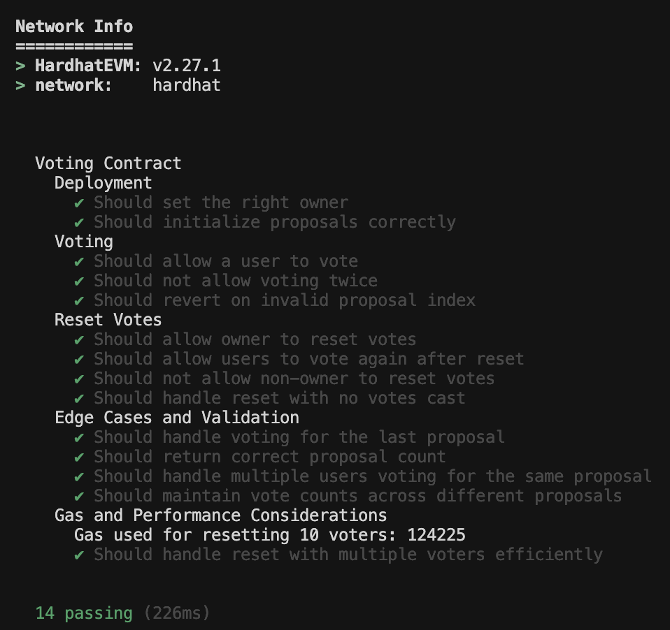
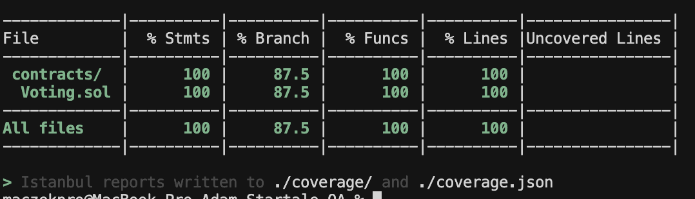
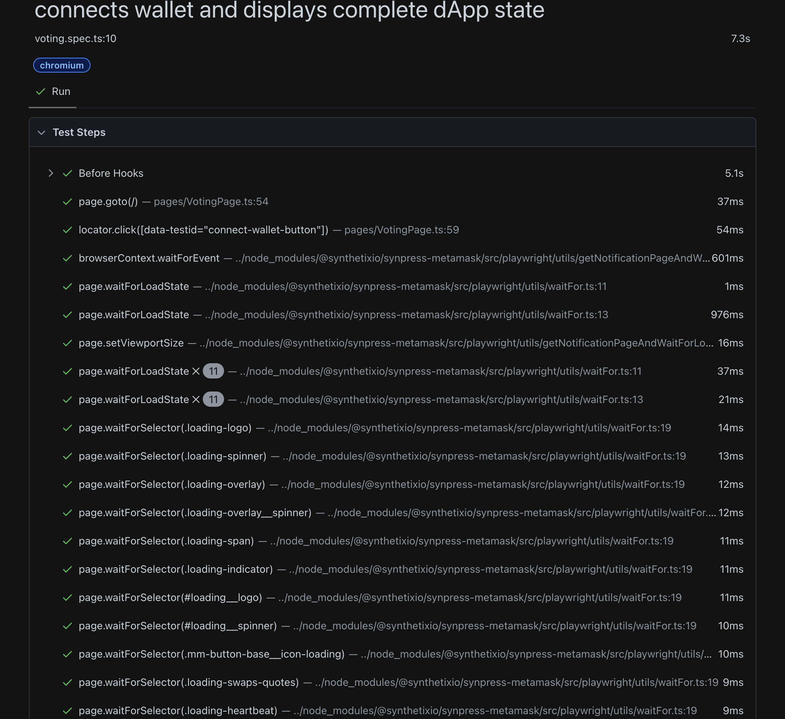
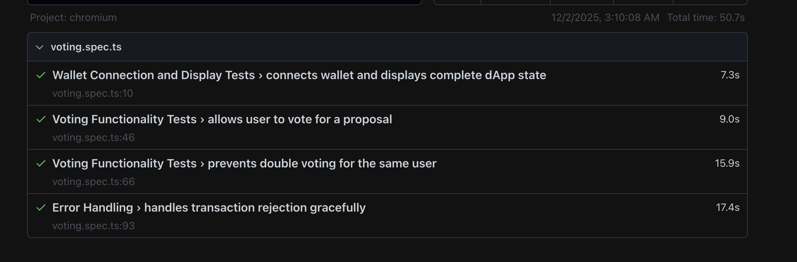
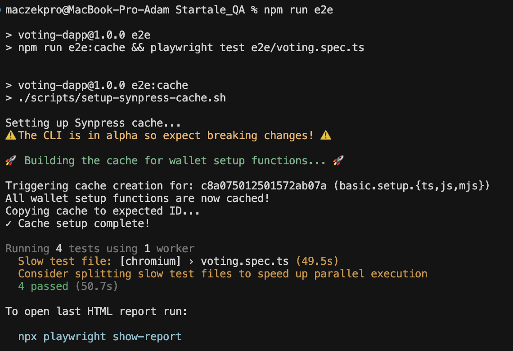

# Voting DApp - QA Assignment

Decentralized voting application with comprehensive test automation for Web3.

**Stack:** Solidity • Hardhat • React • TypeScript • Playwright • Synpress


## 🚀 Quick Start

### Installation
```bash
npm install
cd frontend && npm install && cd ..
```

### Run Application

**Terminal 1:** `npm run node` (save Account #0 private key)  
**Terminal 2:** `npm run compile && npm run deploy && cp deployment.json frontend/public/`  
**Terminal 3:** `npm run frontend` (opens http://localhost:3000)

### MetaMask Setup
1. Add Network: `Hardhat Local` | `http://127.0.0.1:8545` | Chain ID: `1337`
2. Import Account #0 private key
3. Connect at http://localhost:3000

## 🧪 Testing

| Command | Description |
|---------|-------------|
| `npm test` | Unit tests |
| `npm run test:coverage` | Unit tests with coverage report |
| `npm run e2e` | E2E tests (requires running app) |

### Unit Test Coverage an results 





### E2E Test Results







## 🤖 AI Tools Usage

AI tools used (~60-70% time saved):
- **Claude/ChatGPT:** Test strategy
- **Cursor AI:** MVP implementation, React components, Code cleanup and comments 


